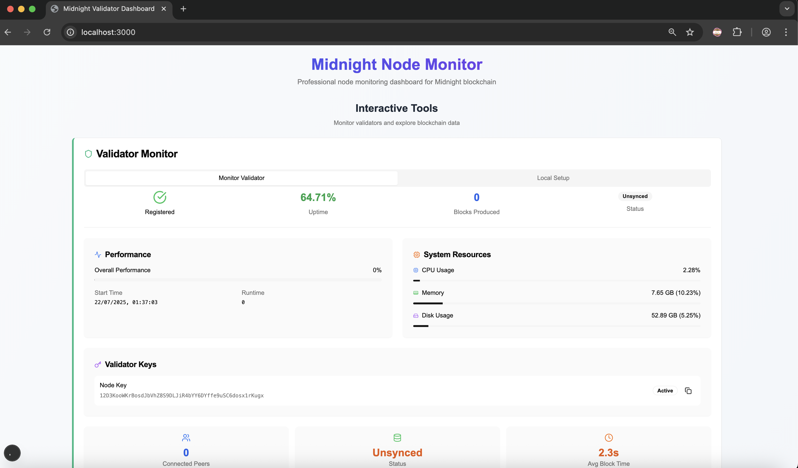
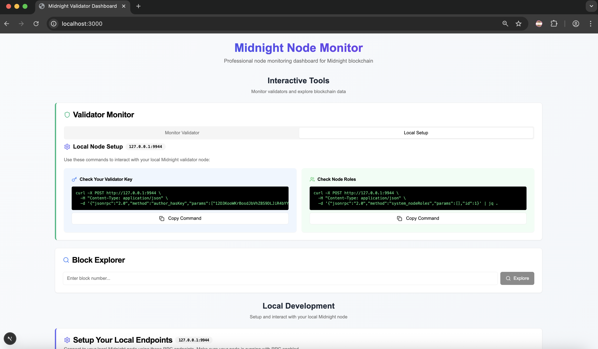
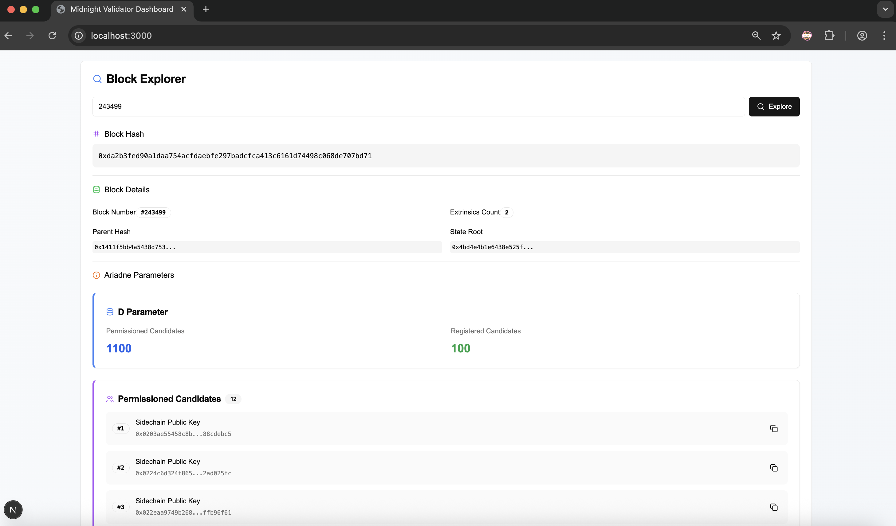
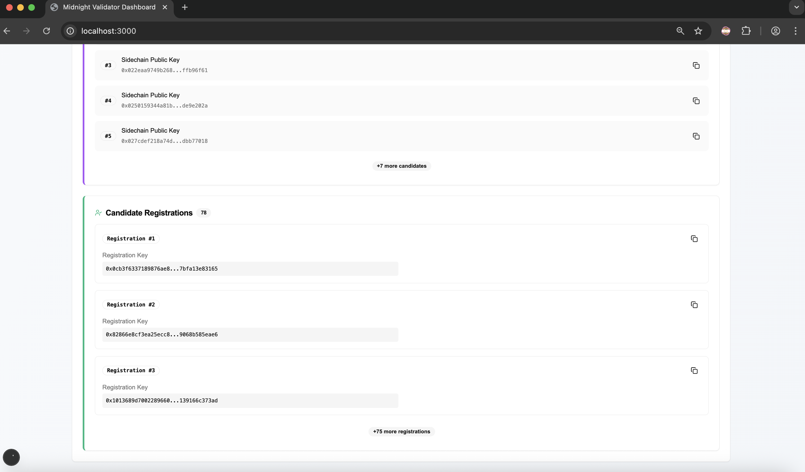
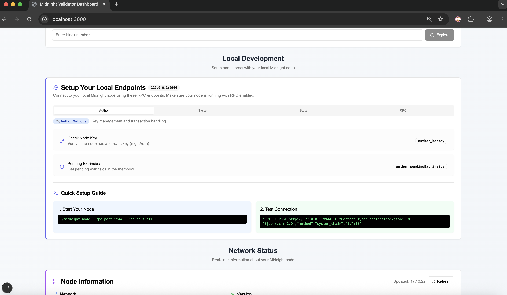
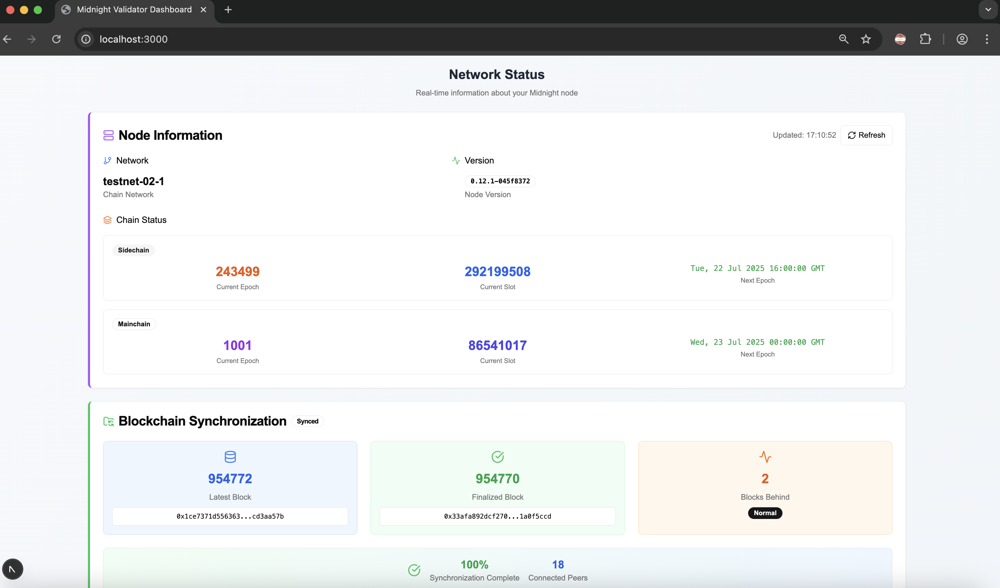
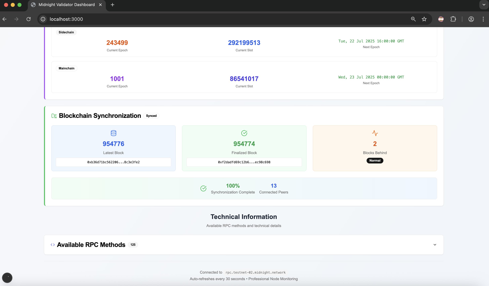
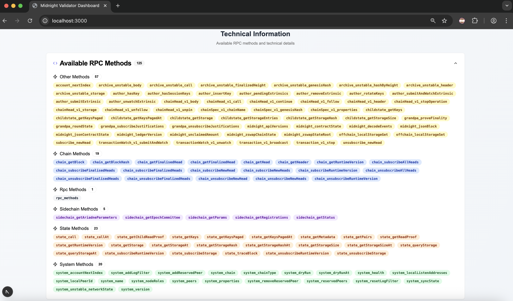

# Midnight Validator Monitor

Professional node monitoring dashboard for the Midnight blockchain.

---

## About

Midnight Node Monitor is a professional and interactive dashboard designed to monitor validators and explore blockchain data on the Midnight blockchain. It provides real-time insights into node performance, system resources, and blockchain synchronization, enabling users to efficiently manage and track their Midnight nodes.

---

## Features

- Real-time monitoring of validator status and performance
- Interactive blockchain explorer with block number lookup
- Local setup guide for connecting and interacting with a Midnight node
- Detailed system resource usage (CPU, memory, disk)
- Node key management and RPC method access
- Automatic data refresh every 30 seconds
- Network and chain status overview with synchronization info

---

## Interface Overview

### Validator Monitor:



### Local Setup



### Block Explorer





### Local Development



### Network Status



### Blockchain Synchronization



### Avaliable RPC methods



## Technologies

- [Midnight blockchain RPC interface](https://docs.midnight.network/develop/nodes-and-dapps/nodes-endpoints#testnet-network)
- Web dashboard built with [TypeScript](https://www.typescriptlang.org/), [React](https://reactjs.org/) & [Next.js](https://nextjs.org/)
- [curl](https://curl.se/) for local connection testing
- [JSON-RPC](https://www.jsonrpc.org/) for node communication
- [Prometheus](https://prometheus.io/) for metrics collection and monitoring
- [Node Exporter](https://github.com/prometheus/node_exporter) to expose system resource metrics to Prometheus
- [Docker](https://www.docker.com/) for containerization and easy deployment

---

## Installation

Follow these steps to set up and run the Midnight Node Monitor locally:

### Clone the project

- Fork and clone this repository:

Using ssh:
```shell
git clone git@github.com:luislucena16/midnight-validator-dashboard.git
```

or

Using http:

```shell
git clone https://github.com/luislucena16/midnight-validator-dashboard.git
```

- Go to the project:

```shell
cd midnight-validator-dashboard
```

### Install dependencies

- Run the following command:

```shell
npm install
```

## Setting up local Infrastructure (TestNet)

For initial testing purposes, it is recommended to run a test with TestNet before doing so with the official node.

This project provides a Docker configuration file called `testnet.yml`. The following services are used within it: `proof-server`, `indexer`, `node` with `prometheus` configurations for metrics and RPC, and finally `node-exporter` for other system metrics.

- Run the following Docker command:

```shell
docker compose -f testnet.yml up -d
```
***Note***: The `-d` stands for detached mode, meaning your container will be running in the background.

### Run the local project 

- After setting up the infrastructure, run the frontend:
```shell
npm run dev
```
***Note***: You must wait a few seconds for the RPCs to send the corresponding information and for the node data to be collected. It refreshes automatically every 30 seconds.

***Congrats! You can see everything at `localhost:3000`.***

## Setting up your server Infrastructure (TestNet):

You can clone the project on your server and run it with your official node. To do so, the following configurations should be taken into account:

- i) Open ports for node and metrics: `9944`, `9615`, `9100`.
- ii) Flags for the node service:
```yml
    command:
      - --rpc-port=9944
      - --rpc-external
      - --prometheus-external
      - --prometheus-port=9615
```
- iii) Add the node-exporter service:
```shell
node-exporter:
image: prom/node-exporter
container_name: 'midnight-validator-dashboard-node-exporter'
ports:
- "9100:9100"
restart: unless-stopped
volumes:
- /:/host:ro
command:
- '--path.rootfs=/host'
```

***Note***: Make sure you set your firewall rules and that your ports are properly protected on your server, to allow connections only from the IP address you call.

### Run the project in your server

- After setting up the infrastructure on your official node, `recreate` your container using `docker compose -f {your container name} up -d` and run:

```shell
npm run dev
```

***Note***: You must wait a few seconds for the RPCs to send the corresponding information and for the node data to be collected. It refreshes automatically every 30 seconds.

***Congrats! You can see everything at `localhost:3000`.***

## Deploy on your own site

You can deploy your dashboard so that it is available at any time, perhaps on a small VPS for static pages or some friendly providers:
 
- i) Vercel
- ii) Railway
- iii) Hetzner
- iv) Netlify
- v) Cloudflare

## Usage

### Validator Monitoring

- Track validator uptime, blocks produced, and overall performance.
- Monitor validator keys and connection status.
- View real-time system resource usage (CPU, memory, disk).

## Blockchain Explorer

- Enter a block number to explore detailed information.
- Monitor latest and finalized blocks with hashes.

## Node RPC Methods

- Access author methods for key management and transaction handling.
- Check node key presence using author_hasKey.
- Retrieve pending extrinsics via `author_pendingExtrinsics`.

## Project Structure

- `app/`: Source code for the dashboard and monitoring tools.
- `app/api/`: Backend endpoints used by each section of the dashboard.
- `components/`: Views and frontend components for the dashboard.
- `docs/`: Project documentationm information, images, etc.
- `components/ui/`: Reusable UI components.
- `hooks/`: Custom React hooks.
- `lib/`: Utility functions and shared logic.
- `public/`: Static public assets (images, fonts, etc.).
- `styles/`: Global styles and CSS files.
- `README.md`: Project overview, setting up and docs.

## Contributing

### Contribution Guidelines

This is a template designed to be used as a starting point for new projects. You can:

1. **Use as Template** - Click "Use this template" to create a new repository
2. **Fork** the repository for your own project
3. **Contribute** - Any PR is welcome to improve the template

If contributing:
1. **Fork** the repository
2. **Create** a feature branch (`git checkout -b feature/amazing-feature`)
3. **Commit** your changes (`git commit -m 'feat: add amazing feature'`)
4. **Push** to the branch (`git push origin feature/amazing-feature`)
5. **Open** a Pull Request

## License

This project is licensed under the MIT License. See the [LICENSE](LICENSE) file for details.

## Project Status
This project is currently in active development. Features are being added regularly, and stability improvements are ongoing. Feedback and contributions are highly appreciated.

## Roadmap - New Features

- [ ] Improve the user interface (UI) for better usability and aesthetics  
- [ ] Add search functionality by different public keys
- [ ] Support for different network stages: `mainnet`, etc
- [ ] Replace `call` with `fetch`functions when request the data
- [ ] Display and monitor granpa, aura and other keys  
- [ ] Enhance validator performance metrics 
- [ ] Add customizable alerting and notifications  
- [ ] Integrate advanced blockchain analytics and reports  
- [ ] Support multi-node monitoring from a single dashboard
- [ ] Deploy instructions using `Vercel`

## Support

If you have issues or questions:

1. Check the [documentation](docs/)
2. Search [existing issues](../../issues)
3. Create a [new issue](../../issues/new)

---

**⭐ If this template is useful to you, consider giving the repository a star!**

---

**Made with ❤️ by the Midnight ecosystem**

